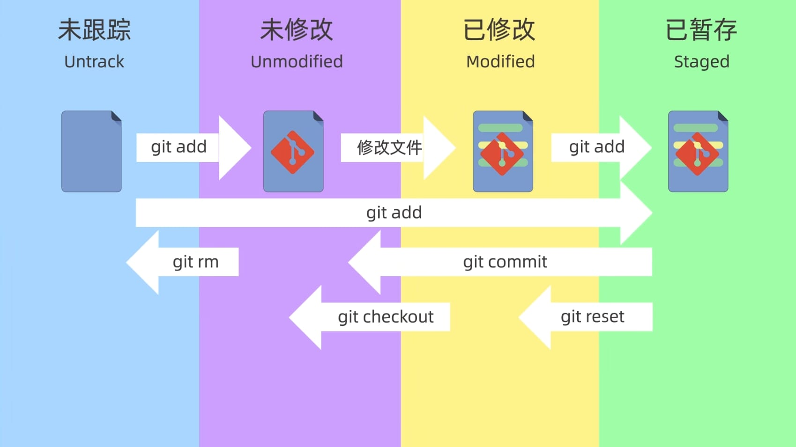

> [!abstract] 简介
> Git是一个开源的分布式版本控制系统，可以有效、高速地处理从很小到非常大的项目版本管理。
> 也是Linus Torvalds为了帮助管理Linux内核开发而开发的一个开放源码的版本控制软件。
> > [!question]- 何为分布式？
> > 简单来说，每个开发者都有一个独立的仓库，可以在本地进行提交、分支等操作，在没有网络和服务器的时候也可以正常工作。
> 
> > [!example]- 用途
> > 1. 保存历史记录：
> > 	1. 查看之前的版本
> > 	2. 查看是谁做了改动
> > 2. 多人协作
> > 	每个人独立制作后进行合并
> > 3. 备份
> > 	主分支的内容保存在每个人的仓库中，不易丢失
> > 4. 试验新功能
> > 	通过分支来尝试新想法，而不会影响主分支的内容
> > 5. 解决冲突
> > 	如果两个人同时修改了同一部分内容，Git会提示冲突，并自己决定采用哪个版本
> > 6. 易于分享
> > 	可以通过[Github](https://github.com/)等网站进行分享

## 常用命令

### 配置Git

#### 用户名

```
git config --global user.name "your name"
```

#### 邮箱

```
git config --global user.email "your email"
```

#### 查看配置文件

```
git config --global --list
```

### 创建仓库

#### 新建

进入到目录后
```
git init
```
会出现一个`.git`文件夹，用于存储仓库信息

#### 克隆

```
git clone <url>
```
> `<url>` 处填写远程仓库地址，如：`https://github.com/JunieXD/juniexd.github.io.git`

### 添加到仓库

#### 添加到暂存区

```
git add <filename>
```
> `filename` 是文件名，可以使用通配符。

> [!tip] 提示
> 使用 `git add .` 可以把当前目录的所有文件添加到暂存区。

#### 查看状态

```
git status
```

#### 查看仓库文件

```
git ls-files <args>
```
> `<args>` 缺省列出所有已跟踪的文件，包括已修改但尚未暂存的文件。
> `-c` 只列出已经通过 git add 添加到暂存区的文件。
> `-o` 只列出未跟踪的文件。
> `-u` 只列出有合并冲突的文件。
#### 提交到仓库

```
git commit -m "message"
```
> `message` 是提交的信息

> [!warning] 注意
> 如果不使用 `-m` 参数，会进入输入提交信息的页面（默认打开vim编辑器）

#### 查看提交记录

```
git log
```

> [!tip] 提示
> `git log --oneline` 查看简洁的提交记录

### 回退仓库

```
git reset <args> <version>
```
> `<args>` 参数可以使用 `--soft` `--hard` `--mixed` 默认参数是 `--mixed`
> `<version>` 参数指定要回退到的版本号（使用 `git log` 查看）

> [!tip] 提示
> `<version>` 可以使用 `HEAD^` 回退到上一个版本

|   参数    | 工作区 | 暂存区 |
| :-----: | :-: | :-: |
| --soft  |  √  |  √  |
| --hard  |  ×  |  ×  |
| --mixed |  √  |  ×  |

#### 查看操作的历史记录

```
git reflog
```
> 可以找到某次误操作之前的版本号进行回退

### 查看文件差异

#### 工作区和暂存区

```
git diff
```
> 查看工作区和暂存区之间所有的文件差异

```
git diff -- <filename1> <filename2> ...
```
> 查看一个或多个文件在工作区和暂存区之间的差异

#### 工作区和版本库

```
git diff <version>
```
> 查看工作区与具体某个提交版本之间的所有的文件差异

> [!tip] 提示
> `git diff HEAD` 查看工作区与最新版本库之间的所有的文件差异
> 
> `git diff <version> -- <filename1> <filename2> ...` 查看工作区与最具体某个版本之间的 指定文件名的多个文件差异
#### 暂存区和版本库

```
git diff --cached <version>
```
> 查看暂存区和指定版本之间的所有文件差异
> `<version>` 缺省则是最新版本（HEAD）

```
git diff --cached <version> -- <filename1> <filename2> ...
```
> 查看暂存区和指定版本之间的指定文件差异

#### 不同版本之间

```
git diff <verison1> <version2>
```
> 查看两个版本之间的差异

```
git diff <verison1> <version2> -- <filename1> <filename2> ...
```
> 查看两个版本之间的指定文件之间的差异

```
git diff <verison1> <version2> --stat
```
> 查看两个版本之间的改动的文件列表

```
git diff <verison1> <version2> src
```
> 查看两个版本之间的文件夹 src 的差异

### 删除暂存区中的文件

```
git rm <filename>
```
> 会同时删除暂存区和工作区的文件，用以简化操作（先删工作区再 `git add` 到暂存区）。
## 概念

### 三个区域（Directory）

> [!note] 文件所在的三个区域
> - 工作区（Working Directory）：当前正在进行工作的区域
> - 暂存区（Staging Area/Index）：在`git add`后暂存的区域
> - 本地仓库（Local Directory）：在`git commit`成功提交后存储的区域


### 四种状态（States）

> [!note] 文件的四种状态
> - 未跟踪（Untrack）
> - 未修改（Unmodified）
> - 已修改（Modified）
> - 已暂存（Staged）

状态间的转换如下图所示

