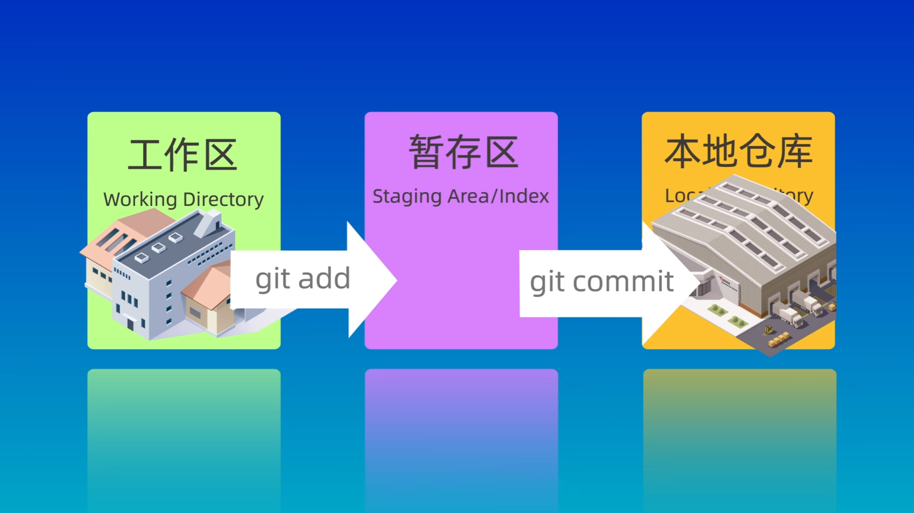

> [!abstract] 简介
> Git是一个开源的分布式版本控制系统，可以有效、高速地处理从很小到非常大的项目版本管理。
> 也是Linus Torvalds为了帮助管理Linux内核开发而开发的一个开放源码的版本控制软件。
> > [!question]- 何为分布式？
> > 简单来说，每个开发者都有一个独立的仓库，可以在本地进行提交、分支等操作，在没有网络和服务器的时候也可以正常工作。
> 
> > [!example]- 用途
> > 1. 保存历史记录：
> > 	1. 查看之前的版本
> > 	2. 查看是谁做了改动
> > 2. 多人协作
> > 	每个人独立制作后进行合并
> > 3. 备份
> > 	主分支的内容保存在每个人的仓库中，不易丢失
> > 4. 试验新功能
> > 	通过分支来尝试新想法，而不会影响主分支的内容
> > 5. 解决冲突
> > 	如果两个人同时修改了同一部分内容，Git会提示冲突，并自己决定采用哪个版本
> > 6. 易于分享
> > 	可以通过[Github](https://github.com/)等网站进行分享

## 常用命令

### 配置Git

#### 用户名

```
git config --global user.name "your name"
```

#### 邮箱

```
git config --global user.email "your email"
```

#### 查看配置文件

```
git config --global --list
```

### 创建仓库

#### 新建

进入到目录后
```
git init
```
会出现一个`.git`文件夹，用于存储仓库信息

#### 克隆

```
git clone <url>
```
> `<url>` 处填写远程仓库地址，如：`https://github.com/JunieXD/juniexd.github.io.git`

## 概念

### 三个区域（Directory）

> [!note] 文件所在的三个区域
> - 工作区（Working Directory）：当前正在进行工作的区域
> - 暂存区（Staging Area/Index）：在`git add`后暂存的区域
> - 本地仓库（Local Directory）：在`git commit`成功提交后存储的区域



### 四种状态（States）

> [!note] 文件的四种状态
> - 未跟踪（Untrack）
> - 未修改（Unmodified）
> - 已修改（Modified）
> - 已暂存（Staged）
> 
> 状态间的转换如下图所示

